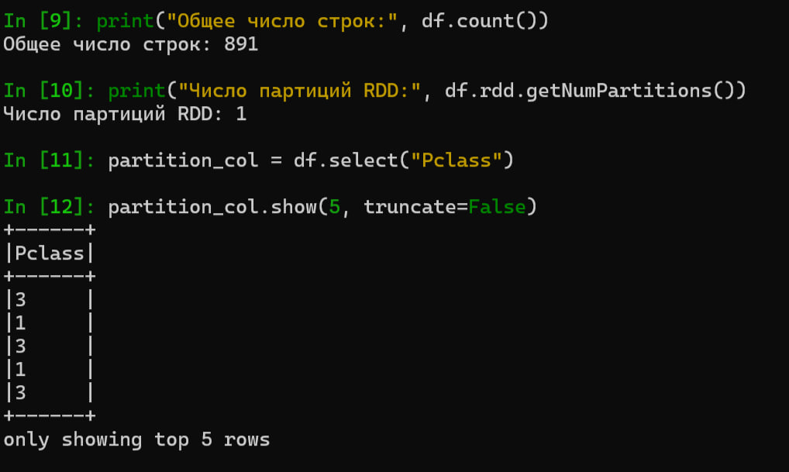
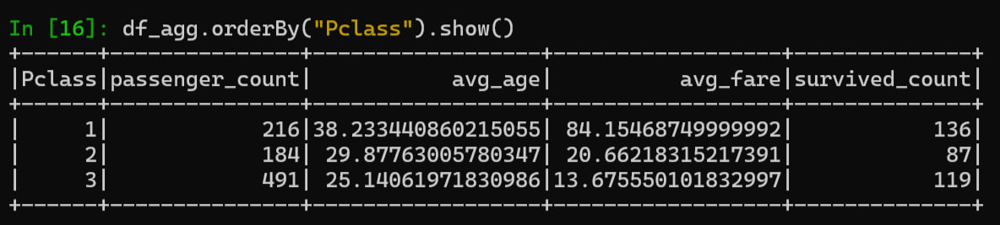
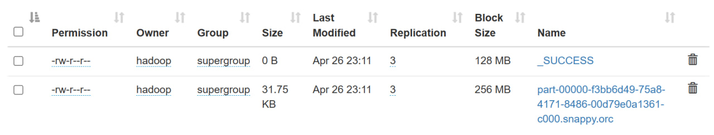
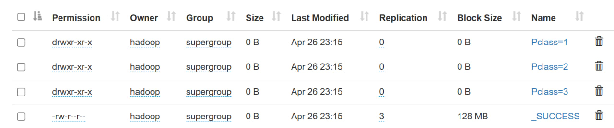

# ДЗ 4 - Использование Apache Spark под управлением YARN для чтения в Hive

Бугаков Максим БПИ226

---
### 1. Подключение к серверу

Прокидываем порты с кластера на локалхост
```bash
ssh -L 9870:127.0.0.1:9870 -L 8088:127.0.0.1:8088 -L 19888:127.0.0.1:19888 team@176.109.91.25
```

---
### 2. Настройка окружения

Устанавливаем зависимости
```bash
sudo apt update 
sudo apt install python3-venv python3-pip
```

Переключаемся на пользователя hadoop
```bash
sudo -i -u hadoop 
```

Установка Spark
```bash
wget https://archive.apache.org/dist/spark/spark-3.5.3/spark-3.5.3-bin-hadoop3.tgz 
tar -xzvf spark-3.5.3-bin-hadoop3.tgz 
```

---
### 3. Настройка переменных окружения

```bash
export HADOOP_CONF_DIR="/home/hadoop/hadoop-3.4.0/etc/hadoop" 
export HIVE_HOME="/home/hadoop/apache-hive-4.0.0-alpha-2-bin" 
export HIVE_CONF_DIR=$HIVE_HOME/conf 
export HIVE_AUX_JARS_PATH=$HIVE_HOME/lib/* 
export PATH=$PATH:$HIVE_HOME/bin 
export SPARK_LOCAL_IP=192.168.1.94 
export SPARK_DIST_CLASSPATH="/home/hadoop/spark-3.5.3-bin-hadoop3/jars/*:/home/hadoop/hadoop-3.4.0/etc/hadoop:/home/hadoop/hadoop-3.4.0/share/hadoop/common/lib/*:/home/hadoop/hadoop-3.4.0/share/hadoop/common/*:/home/hadoop/hadoop-3.4.0/share/hadoop/hdfs:/home/hadoop/hadoop-3.4.0/share/hadoop/hdfs/lib/*:/home/hadoop/hadoop-3.4.0/share/hadoop/hdfs/*:/home/hadoop/hadoop-3.4.0/share/hadoop/mapreduce/*:/home/hadoop/hadoop-3.4.0/share/hadoop/yarn:/home/hadoop/hadoop-3.4.0/share/hadoop/yarn/lib/*:/home/hadoop/hadoop-3.4.0/share/hadoop/yarn/*:/home/hadoop/apache-hive-4.0.0-alpha-2-bin/*:/home/hadoop/apache-hive-4.0.0-alpha-2-bin/lib/*"
```

```bash
cd spark-3.5.3-bin-hadoop3/ 
export SPARK_HOME=`pwd` 
export PYTHONPATH=$(ZIPS=("$SPARK_HOME"/python/lib/*.zip); IFS=:; echo "${ZIPS[*]}"):$PYTHONPATH 
export PATH=$SPARK_HOME/bin:$PATH 
```


---
### 4. Настройка Python


```bash
cd ~ 
python3 -m venv venv 
source venv/bin/activate 
pip install -U pip 
pip install ipython 
pip install onetl[files] 
```

---
### 5. Подготовка данных в Hadoop


```bash
hdfs dfs -mkdir -p /input
wget https://raw.githubusercontent.com/datasciencedojo/datasets/master/titanic.csv -O titanic.csv
hdfs dfs -put titanic.csv /input
```


---
### 6. Запуск Hive Metastore


```bash
nohup hive \
  --hiveconf hive.server2.enable.doAs=false \
  --hiveconf hive.security.authorization.enabled=false \
  --service metastore \
  1>> /tmp/metastore.log 2>&1 &
```

---
### 7. Запуск Spar

```bash
ipython 
```

Чтение данных из Hadoop
```python 
from pyspark.sql import SparkSession, functions as F
from onetl.connection import SparkHDFS, Hive
from onetl.file import FileDFReader
from onetl.file.format import CSV

# Создаём SparkSession
spark = SparkSession.builder \
    .master("yarn") \
    .appName("spark-with-yarn-titanic") \
    .config("spark.sql.warehouse.dir", "/user/hive/warehouse") \
    .config("spark.hive.metastore.uris", "thrift://tmpl-jn:9083") \
    .enableHiveSupport() \
    .getOrCreate()

# Настраиваем подключение к Hadoop
hdfs = SparkHDFS(host="tmpl-nn", port=9000, spark=spark, cluster="test")

# Читаем CSV из Hadoop
reader = FileDFReader(
    connection=hdfs,
    format=CSV(delimiter=",", header=True),
    source_path="/input"
)
df = reader.run(["titanic.csv"])

# Проверки
print("Общее число строк:", df.count())
print("Число партиций RDD:", df.rdd.getNumPartitions())

# Столбец для партиционирования в Hive
partition_col = df.select("Pclass")
partition_col.show(5, truncate=False)
```

Результат выполнения


---

Применение нескольких трансформаций данных
```python 
from pyspark.sql.types import IntegerType, DoubleType

# Приведём столбцы к нужным типам
df2 = df \
    .withColumn("Survived", F.col("Survived").cast(IntegerType())) \
    .withColumn("Age",     F.col("Age").cast(DoubleType())) \
    .withColumn("Fare",    F.col("Fare").cast(DoubleType()))

# Агрегация по классу каюты (Pclass)
df_agg = df2.groupBy("Pclass").agg(
    F.count("*").alias("passenger_count"),
    F.avg("Age").alias("avg_age"),
    F.avg("Fare").alias("avg_fare"),
    F.sum("Survived").alias("survived_count")
)

# Отсортируем по Pclass и выведем
df_agg.orderBy("Pclass").show()
```

Результат выполнения


---
### 8. Запись данных в Hive разными способами

Создаем новую БД
```python
spark.sql("CREATE DATABASE IF NOT EXISTS test3")
```

Обычная запись 
```python
from onetl.db import DBWriter

# Подключение к Hive
hive = Hive(spark=spark, cluster="test") 
hive.check() 

DBWriter(connection=hive, table="test3.spark_auto", options={"if_exists":"replace_entire_table"},).run(df)
```
Таска выполнена

Создана 1 таблица, потому что количество партиций равно 1

---

Партиционирование по `Pclass`
```python
DBWriter(connection=hive, table="test3.hive_partitioned",options={"if_exists":"replace_entire_table","partitionBy":"Pclass"},).run(df)
```
Таска выполнена

Созданы 3 таблицы, потому что количество `Pclass` равно 3



Завершаем сессию Spark
```python
spark.stop()
```

---
### 9. Чтения данных стандартным клиентом hive
```bash
beeline -u jdbc:hive2://tmpl-jn:5432 -n scott -p tiger
```
```bash
USE test3; 
SHOW TABLES; 
SELECT * FROM spark_auto LIMIT 3; 
SELECT * FROM hive_partitioned LIMIT 3; 
```


